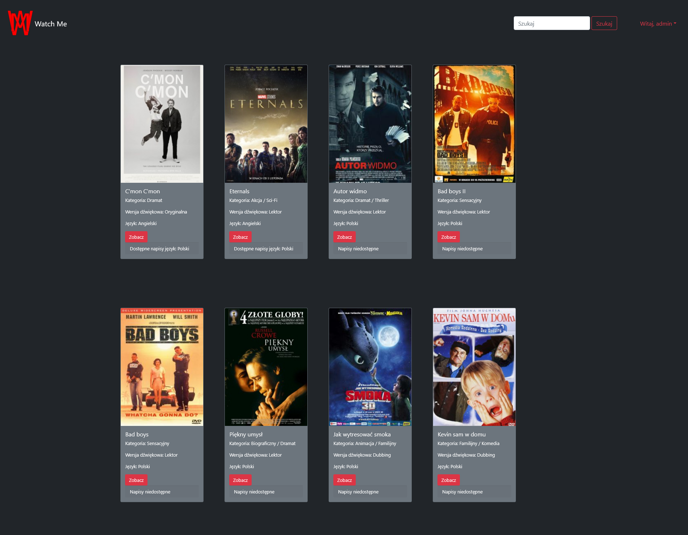

# WatchMe - Online Movie Rental

## Description
WatchMe is an application developed using the Python language and the Django framework. It is used to operate an online movie rental service. It offers easy management of movies, users and administrators. It displays notifications of all activities and allows you to rent movies for a period of 7 days.

## Features:
- **Create/Read/Update/Delete:**
  - Movie
  - Author
  - User
  - AdminUser
- **User Actions:**
  - Register
  - Login
  - Logout
- **Movie Actions:**
  - Search for a movie
  - Rent Movie (default for 7 days)
  - View Rented Movies
  - View movie details
- **Other:**
  - Alerts after all operations (add, edit, delete, search, login, logout, rent, end of rent, etc.)
  - "Coins" as currency

##Data Model Diagram

## Endpoints
| Action             | Endpoint               | Auth          |
|--------------------|------------------------|---------------|
| Home Page          | `/store/`              | **Everyone**  |
| Search Movie       | `/store/movie/search`  | **Everyone**  |
| Registration       | `/store/register`      | **Everyone**  |
| Login              | `/store/login`         | **Everyone**  |
| Movie Details      | `/store/movie/details` | **Everyone**  |
| Logout             | `/store/logout`        | **Logged in** |
| User Details       | `/store/user/details`  | **Logged in** |
| Rented Movies      | `/store/user/rented`   | **Logged in** |
| Add Coins          | `/store/user/addcoins` | **Logged in** |
| Rent Movie         | `/store/movie/rent?id` | **Logged in** |
| Add Movie          | `/store/movie/add`     | **Superuser** |
| Movie Edit List    | `/store/movie/list`    | **Superuser** |
| Edit Movie Details | `/store/movie/edit?id` | **Superuser** |
| Delete Movie       | `/store/movie/delete`  | **Superuser** |
| Django Admin Panel | `/admin`               | **Superuser** |

##Screenshots

###Home Page

###Search Movie Results List Page

<!--###Register Form Page
-->

###User Exist Alert on Register Page

###Login Form Page and Bad Credentials Alert

###Movie Details Page

###Edit User Details Form Page and Edit Alert

###Rented Movies List Page

###Add Coins Form Page

###Rented Movie Success Alert on Movie Details Page

###Add Movie Form Page and Added Movie Success Alert

###Movies Edit or Delete List Page and Edited Success Alert

###Edit Movie Form Page

###User Actions Panel

###Admin Actions Panel

###Lost Access To Watch Movie Alert on Home Page

###Unauthorized Alert on Home Page

###Admin Django Panel

##Tech Stack

## Author
- [@Oskar Wal](https://github.com/OskarWal)
